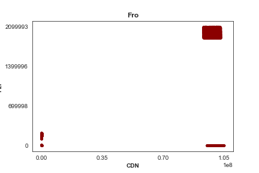

## Tech Choices:
For this analysis, I am using Python and the packages Pandas (for data structuring and manipulation), numpy (for some array operations), and matplotlib/seaborn (for plotting).

## Exploration: Approach & Findings
I began my exploration by plotting various relationships and following any leads that jumped out at me.

It quickly became clear that there is significant clustering across all axes, be it courtesy of an unsupported browser, an ISP reluctant to make P2P connections happen, or some streams being far heavier than others; in each case, the relative use of P2P vs. the CDN presented significantly clustered hits, from which we may make some inferences.

To get a quick feeling for how the data interact with the three categorical variables we are given, we may look at some simple heatmaps. Since there are only three variables, this is quite an easy task. I decided to look both at the total traffic (upper row) and the fraction of that traffic that was served through P2P resources (bottom row). This allows us to both know where we should be looking to make improvements (we should be focusing on high-impact areas, i.e. high-traffic corners of parameter-space), and gives us a metric by which to evaluate the current situation. (Please excuse the cramped feeling of this plot; given its role and time constraints, it's not worth making it super pretty.)

These plots show us that there is significant variation across all three variables. Looking at the first row we immediately see that streams 4 and 8 are orders of magnitude larger than the other streams, and that the browsers Olga and DT have very low traffic. Looking at the second row, we see that the Vectrice browser apparently just doesn't support P2P transfers at all, and that streams 3 and 4 use have very low P2P transfer rates. At this point, we can say that if we really wanted to increase usage rates, we should focus on streams 4 and 8, which have the two highest-usages and the worst and third-worst fractional P2P usages, and that we should implement. While the plots below don't really tell as anything we couldn't learn from the heatmaps, they do make these group-specific insights a little clearer:

~

However, we can do better than that. We may look for clustering in the data by plotting each category, one by one (here in gif form), in data usage-space. For these gifs, I have subsetted the data to only include users who are connecting to the company's back-end, since if we are looking for patterns in how the P2P services are being used, we should only look at those that actually ~are~ being used.

The patterns that appear in the data (large blocks of users who are drawing from both P2P and the CDN, a small block who are exclusively pulling CDN data, and some other small groups scattered around) makes me think that these groupings are determined by some factor not captured in the given data set (i.e. geography, a temporal element, or something else). Since we would ideally like to see as many users in the upper left as possible, this indicates that discovering the source of these groups would be useful for improving service. To this end, if we were given more data by which these users might be grouped, we could use some clustering algorithms (or maybe even PCA, depending on what additional data we were given) to root out the cause of these groupings.

## Recommendations
I would make the following recommendations:

* **Focus efforts on improving streams 4 and 8.** These streams are orders of magnitude heavier than the others, indicating that there is probably a categorical difference between them and the rest. Therefore, energy should be spent improving that category of stream.

* **Implement support for the Vectrice browser and DT ISP.** since at the moment it has no P2P usage.

* **Find what is causing the clustering in data usage-space.** These clusters offer a valuable key into identifying what is working and what isn't, and consequently how to improve services. Whether this should happen through drawing on additional data or through a more in-depth study of the available data is not immediately clear to me, but this is a very solvable problem.

## With More Time, I Would:

* **Make my plots more elegant!** These are definitely still a little rough around the edges.

* **Work more in data-usage space.** There is more information contained in the gifs than I got to fully pull out. I did some preliminary secondary breakdowns (i.e. coloring by another categorical variable), which led to random distributions in some cases and well-segmented groups in others(i.e. one browser was responsible for a given group or something), but didn't really hit on any actionable insights. But I think there's more to be had here.

* **Implement some ML** (this would probably require more data, too). I played with some clustering stuff for this just for fun (KNN and its friends, spectral clustering and DBSCAN), but since we don't have any more detailed metrics (timestamps, location, etc), there wasn't much to do with it more than just identify that those clusters are present, which I could do with my eye.

<!--- The End --->
